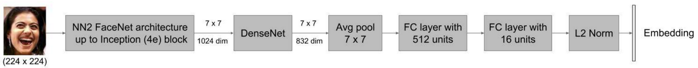

# OccFECNet: Teacher-Student Knowledge Distillation for Occluded Facial Expressions



OccFECNet provides a robust approach to facial expression similarity under severe facial occlusions (e.g., face masks, sunglasses, hands). This project builds upon the original FECNet architecture, training a student model to align with a pre-trained teacher model through a Teacher-Student Knowledge Distillation framework combined with a Residual Spatial Attention Mechanism.

## Overview

Traditional facial expression models degrade heavily when parts of the face are occluded. This project solves that by enforcing that a student network produces embeddings for occluded faces that closely match the teacher network's embeddings for the same faces when clean.

### Key Features
- **Teacher-Student Distillation:** Uses Cosine Embedding Loss to match occluded student outputs with clean teacher outputs without requiring triplet loss/annotations.
- **Residual Spatial Attention:** An autonomous module inside the student network that identifies and downweights occluded feature regions (handling up to 40% face occlusion).
- **Mask-Free Inference:** The attention mechanism operates purely on image features at inference, predicting occlusions dynamically without explicit binary mask inputs.
- **Progressive Curriculum Training:** A 4-phase training regimen that incrementally introduces complexity, occlusion severity, and attention regularization to prevent model collapse.

## Architecture

1. **Frozen Extractors:** Both teacher and student use a frozen FaceNet backbone (up to inception 4e) to extract robust, identity-invariant feature maps (7×7×1024).
2. **Residual Spatial Attention Module (Student Only):** Placed after the FaceNet backbone. It fuses features, computes an attention map via a sigmoid activation, and modulates features additively via a learned parameter $\beta$. 
3. **Refinement:** A 1×1 convolution reduces feature dimensions, which are then processed by a DenseNet block (5 layers, growth rate 64), pooled, and passed through linear layers.
4. **Embedding:** The final output is a 16-dimensional L2-normalized embedding.

## Multi-Component Loss Function

The student model balances four objectives during training:
$L_{\text{total}} = \lambda_1 L_{\text{distill}} + \lambda_2 L_{\text{consistency}} + \lambda_3 L_{\text{attention-reg}} - \lambda_4 L_{\text{attention-diversity}}$

- **Distillation Loss:** Cosine embedding loss between teacher's clean face and student's occluded face embeddings.
- **Consistency Loss:** Ensures the student maintains benchmark performance on clean faces.
- **Attention Regularization:** Penalizes the attention module when it inappropriately focuses on occluded regions (utilizing binary masks only available during training).
- **Attention Diversity:** An entropy term that prevents the attention map from collapsing into uniform values map wide.

## Training Procedure

The model trains across 4 progressive phases:
1. **Baseline Distillation (Epochs 1-10):** Train with clean faces and no active attention ($\beta = 0$). Establish a solid baseline.
2. **Introduce Occlusion (Epochs 11-20):** Introduce 1-20% occlusion gradually. Train using distillation and consistency losses, but keep the attention module frozen.
3. **Activate Attention (Epochs 21-40):** Unfreeze the attention weights and $\beta$. Gradually increase occlusion complexity up to 40% and scale the attention regularization $\lambda_3$.
4. **Full Training (Epochs 41-60):** Run with full occlusion spectrum (10-40%) and stabilized loss hyper-parameters targeting generalization.

## Project Structure (Partial)

- `FECNet.py`: Base Network definition.
- `train_curriculum.py`: Master training script orchestrating the dataset loading and 4-phase curriculum.
- `inference.py`: Standard inference scripts supporting mask-free attention mapping.
- `utils/`: Includes loss formulations (`distillation_losses.py`), data preparation, and training loggers.
- `datasets/`: Dataset wrappers for AffectedNet, RAF-DB with integrated synthetic occlusion generation scripts.

## Setup & Execution

### Dependencies
```bash
pip install -r requirements.txt
```
*Tested with PyTorch 2.0+, and utilizing libraries like dlib or MediaPipe for initial face landmark alignment.*

### Preprocessing & Training
1. Obtain datasets (e.g., AffectNet, RAF-DB) into the `data/` directory.
2. Synthetic occlusions are generated on the fly inside the dataloaders (`paired_occlusion_dataset.py`).
3. View `TRAINING_GUIDE.md` for extended documentation on executing the training curriculum.

## References

- **FECNet:** Vemulapalli & Agarwala, "*A Compact Embedding for Facial Expression Similarity*" (CVPR 2019)
- **FaceNet:** Schroff et al. (CVPR 2015)
- **DenseNet:** Huang et al. (CVPR 2017)
